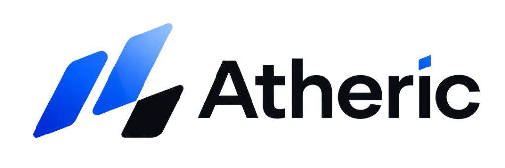

<div align="center">

<picture>
  <source media="(prefers-color-scheme: dark)" srcset="./assets/atheric-logo-white.png" />
  <source media="(prefers-color-scheme: light)" srcset="./assets/atheric-logo-dark.png" />
  
</picture>

### Riset, Ranking & Prediksi Saham IDX Berbasis AI

Pantau pasar, lihat peringkat harian emiten BEI dari model AI, dan evaluasi saham favorit Anda.<br />
Satu akun untuk aplikasi Android dan web.

<p>
  <a href="https://github.com/mleGIBEItelyu/atheric_release/releases/latest"></a>
  
  <a href="https://atheric.id"></a>
  <a href="./LICENSE"></a>
</p>

<p>
  <a href="https://github.com/mleGIBEItelyu/atheric_release/releases/latest/download/atheric_release.apk"></a>
  &nbsp;
  <a href="https://atheric.id"></a>
</p>

[Fitur](#fitur) · [Pasang](#unduh--pasang) · [Perbarui](#memperbarui-aplikasi) · [Verifikasi APK](#verifikasi-keaslian-apk) · [FAQ](#pertanyaan-umum) · [Bantuan](#bantuan)

</div>

---

## Sekilas

Atheric adalah terminal riset untuk saham Bursa Efek Indonesia. Setiap hari bursa, setelah pasar tutup, model AI Atheric menilai sekitar 800 emiten, lalu menyusun peringkat beserta sinyal **Bullish**, **Netral**, atau **Bearish**. Hasilnya bisa dibuka di aplikasi Android maupun di [atheric.id](https://atheric.id) dengan akun yang sama.

> [!NOTE]
> Repositori ini khusus untuk distribusi berkas instalasi (APK) dan catatan rilis. Kode sumber aplikasi dikelola di repositori privat.

---

## Fitur

### Analisis & prediksi

- **Ranking AI harian.** Peringkat emiten beserta desil dan sinyal model, diperbarui setiap hari bursa setelah penutupan.
- **Rangkuman AI per saham.** Ringkasan prospek emiten dengan target resistensi, batas _stop loss_, dan sinyal model.
- **Sentimen 4 pilar.** Berita, analisis teknikal, kondisi makro, dan prediksi model digabung menjadi satu skor.
- **Analisis fundamental.** Valuasi, rasio keuangan, dan tesis AI untuk tiap emiten.

### Pantau pasar

- **Harga real-time.** IHSG dan pergerakan harga saham diperbarui langsung tanpa perlu memuat ulang.
- **Filter indeks.** IDX30, LQ45, KOMPAS100, dan ISSI (mengacu pada Daftar Efek Syariah OJK terbaru).
- **Favorit & Evaluasi Favorit.** Simpan saham, lalu bandingkan harga dan prediksi AI pada saat disimpan dengan kondisi sekarang.
- **Berita & Weekly Market Insight.** Berita emiten terkini dan ulasan pasar setiap pekan.
- **Notifikasi push.** Kabar untuk saham favorit dan peringatan keamanan akun, misalnya login dari perangkat baru.

### Akun & keamanan

- Masuk dengan email atau akun Google, lalu aktifkan **login biometrik** (sidik jari atau wajah).
- **Perangkat Aktif:** lihat perangkat yang sedang login dan keluarkan sesi yang tidak Anda kenali.
- Tanda tangan APK diperiksa saat aplikasi dibuka. APK yang dimodifikasi, perangkat yang di-root, dan alat _hooking_ seperti Frida akan memunculkan peringatan.
- Koneksi hanya diterima dengan sertifikat SSL yang valid, kode aplikasi diobfuskasi, dan tangkapan layar diblokir untuk melindungi data akun.

---

## Unduh & pasang

| Item           | Keterangan                           |
| :------------- | :----------------------------------- |
| **Berkas**     | `atheric_release.apk`                |
| **Minimum**    | Android 11 (API 30)                  |
| **Target**     | Android 16 (API 36)                  |
| **Arsitektur** | `arm64-v8a`, `armeabi-v7a`, `x86_64` |
| **Ukuran**     | sekitar 60 MB                        |
| **Nama paket** | `com.atheric.app`                    |

1. Unduh **`atheric_release.apk`** lewat tombol **Unduh APK** di atas atau dari halaman [rilis terbaru](https://github.com/mleGIBEItelyu/atheric_release/releases/latest).
2. Buka berkas dari notifikasi unduhan atau dari aplikasi **File Manager**.
3. Jika Android meminta izin memasang dari sumber tidak dikenal, ketuk **Setelan**, aktifkan **Izinkan dari sumber ini**, lalu kembali.
4. Ketuk **Instal**. Setelah selesai, buka **Atheric** dan masuk dengan akun Anda atau akun Google.

> [!TIP]
> Google Play Protect bisa menampilkan peringatan karena aplikasi dipasang di luar Play Store. Hal ini wajar untuk APK yang dipasang manual. Pastikan berkas berasal dari halaman ini (lihat [Verifikasi keaslian APK](#verifikasi-keaslian-apk)), lalu lanjutkan pemasangan.

---

## Memperbarui aplikasi

| Versi yang terpasang      | Cara memperbarui                                                                                                                                                  |
| :------------------------ | :---------------------------------------------------------------------------------------------------------------------------------------------------------------- |
| **1.0.6 atau lebih baru** | Buka tab **Lainnya → Pembaruan Aplikasi**. Aplikasi mengecek rilis terbaru di repositori ini, mengunduh APK, lalu membuka layar pemasangan.                       |
| **Di bawah 1.0.6**        | Hapus (uninstall) aplikasi Atheric lama, lalu pasang APK terbaru. Cukup dilakukan sekali. Saham favorit tersimpan di server, jadi Anda hanya perlu masuk kembali. |

Pengecekan pembaruan juga berjalan otomatis setiap kali aplikasi dibuka kembali. Catatan perubahan setiap versi tersedia di halaman [Releases](https://github.com/mleGIBEItelyu/atheric_release/releases).

---

## Verifikasi keaslian APK

Unduh Atheric hanya dari halaman ini. Ada dua cara memastikan berkas yang Anda pegang adalah rilis resmi.

### 1. Checksum berkas

Nilai SHA-256 berubah di setiap versi dan tertera di samping `atheric_release.apk` pada halaman rilis. Hitung nilai berkas Anda, lalu bandingkan:

```powershell
# Windows (PowerShell)
Get-FileHash .\atheric_release.apk -Algorithm SHA256
```

```bash
# macOS / Linux
sha256sum atheric_release.apk
```

### 2. Sertifikat penanda tangan

Semua rilis resmi ditandatangani dengan sertifikat yang sama, dan sertifikat ini tidak berubah antarversi.

| Item        | Nilai                                                                                             |
| :---------- | :------------------------------------------------------------------------------------------------ |
| **Pemilik** | `CN=Atheric Production, OU=Mobile Engineering, O=Atheric Inc, L=Jakarta, ST=DKI Jakarta, C=ID`    |
| **SHA-256** | `CD:1E:2A:F8:33:C8:D2:73:9C:0A:D1:FC:5F:10:82:3E:42:35:B2:0F:4E:C3:37:FF:37:F1:F1:FA:15:7F:3C:71` |

Periksa dengan `apksigner` dari Android SDK Build-Tools:

```bash
apksigner verify --print-certs atheric_release.apk
```

Baris `certificate SHA-256 digest` harus bernilai `cd1e2af833c8d2739c0ad1fc5f10823e4235b20f4ec337ff37f1f1fa157f3c71`. Android sendiri juga menolak memasang APK bersertifikat lain di atas Atheric yang sudah terpasang, sehingga APK tiruan tidak bisa menimpa aplikasi resmi.

---

## Pertanyaan umum

<details>
<summary><b>Muncul "Aplikasi tidak terpasang" saat memasang versi baru</b></summary>
<br />

Biasanya terjadi karena versi yang terpasang masih di bawah 1.0.6 atau berasal dari sumber lain. Hapus aplikasi Atheric yang lama, lalu pasang ulang APK dari halaman ini. Pastikan juga ruang penyimpanan masih cukup.

</details>

<details>
<summary><b>Muncul "Peringatan Integritas Aplikasi" saat aplikasi dibuka</b></summary>
<br />

Aplikasi mendeteksi salah satu kondisi berikut: APK tidak ditandatangani sertifikat resmi, perangkat di-root atau di-jailbreak, atau ada debugger maupun alat _hooking_ yang aktif. Hapus aplikasi, unduh ulang dari halaman ini, dan pasang kembali. Pada perangkat yang di-root, peringatan ini akan tetap muncul.

</details>

<details>
<summary><b>Kenapa tidak bisa mengambil tangkapan layar atau merekam layar?</b></summary>
<br />

Disengaja. Atheric memblokir tangkapan layar dan rekaman layar untuk melindungi data akun dan saham favorit Anda.

</details>

<details>
<summary><b>Apakah akun di aplikasi dan di web sama?</b></summary>
<br />

Ya. Akun, saham favorit, dan notifikasi tersinkron antara aplikasi Android dan [atheric.id](https://atheric.id). Satu akun bisa aktif di satu ponsel dan satu browser sekaligus. Login di ponsel baru akan mengeluarkan sesi di ponsel lama, sementara sesi web tetap aktif.

</details>

<details>
<summary><b>Apakah tersedia untuk iPhone?</b></summary>
<br />

Belum. Pengguna iPhone dan iPad dapat memakai versi web di [atheric.id](https://atheric.id) dengan fitur yang sama.

</details>

---

## Bantuan

- **Di dalam aplikasi:** tab **Lainnya → Bantuan & Support** untuk mengirim tiket.
- **Email:** [support@atheric.id](mailto:support@atheric.id)
- **Riwayat rilis:** [GitHub Releases](https://github.com/mleGIBEItelyu/atheric_release/releases)

---

## Lisensi

Berkas instalasi, aset visual, dan dokumentasi di repositori ini dilindungi lisensi proprietary Atheric AI. Rincian lengkap tersedia di berkas [LICENSE](./LICENSE). Algoritma peramalan, model AI, arsitektur data, dan identitas visual Atheric merupakan milik Atheric AI.

## Penyangkalan

> [!WARNING]
> Seluruh data, sinyal, peringkat, prediksi harga, dan rangkuman AI di Atheric disediakan sebagai **alat bantu riset dan edukasi**, bukan anjuran, ajakan, atau jaminan keuntungan untuk membeli maupun menjual efek apa pun. Kinerja masa lalu dan hasil prediksi model tidak menjamin hasil di masa depan. Setiap keputusan investasi sepenuhnya menjadi tanggung jawab masing-masing investor.

---

<div align="center">
  
  <br />
  <sub>Hak Cipta © 2026 Atheric AI. Seluruh hak cipta dilindungi undang-undang.</sub>
</div>
